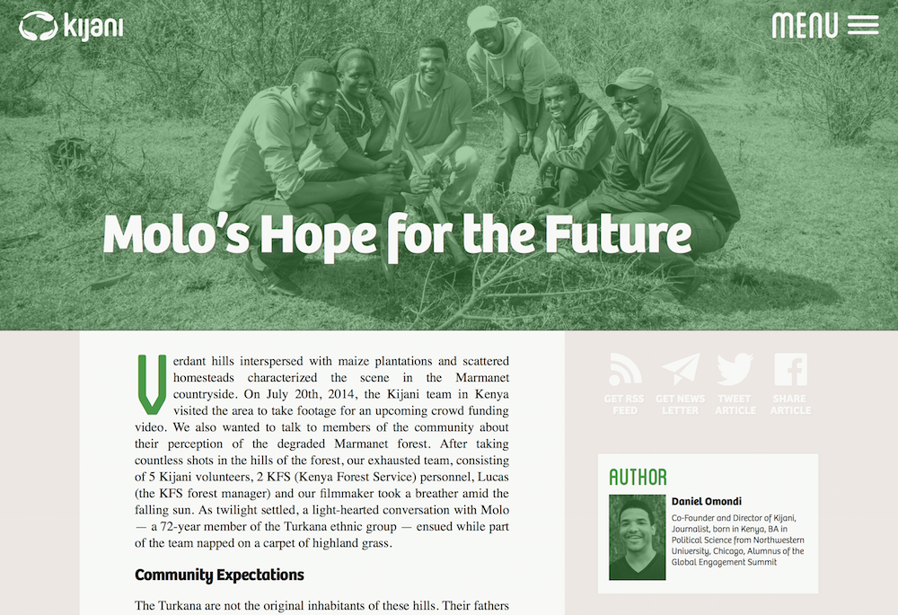

# Kijani Webdesign

## Description
This is a repository to experiment with the design of the [Kijani Blog](http://blog.kijani.co) and also for the general [Kijani Website](http://kijani.co) in the future.

This is not supposed to host the actual code for the Kijani Blog and the Kijani Website, which are hosted at:
- [dudheit314/kijani-blog](https://github.com/dudheit314/kijani-blog)
- [mrloh/kijani.ngo](https://github.com/MrLoh/kijani.ngo)

Feel free to contribute to this by sending me pull requests.

## Requirements

This directory includes no backend. Therefore no local server is needed to run it. The fonts are partially provided through my Typekit, but should be accessible on localhost as well.

The styles are written in Sass. Grunt is included for running Autoprefixer (enables cross-browser compatibility), Sass compiling, and CSS/JS minifying. To use it:

1. Run `npm install` once to install dependencies.
2. Use `grunt` to prefix, sass compile and minify, or `grunt watch` to automatically compile on save.

## Todos
- [x] ~~Implement Basic Article Style~~
- [x] ~~Fix Heading and Hero Image~~
- [x] ~~Restructure Folders~~
- [x] ~~Finish Author Section~~
- [x] ~~Finish More Articles Section~~
- [x] ~~Add Scrolling over the Header~~
- [x] ~~Add Share and Subscribe Section~~
- [x] ~~Add Image Captionss~~
- [x] ~~Add Navigation~~
- [x] ~~Create Mobile Styles~~
- [x] ~~Make Crossbrowser Compatible~~
- [x] ~~Add List Styles~~
- [x] ~~Add Navbar on Scroll Up~~
- [x] ~~Add Citation Styles~~
- [x] ~~Add Archive Page~~
- [ ] Add Comments
- [ ] Add Footer
- [ ] Add Social Media to Archive Page

## Current Status
Visit the page life at: [mrloh.github.io/kijaniwebdesign](http://mrloh.github.io/KijaniWebdesign/)

